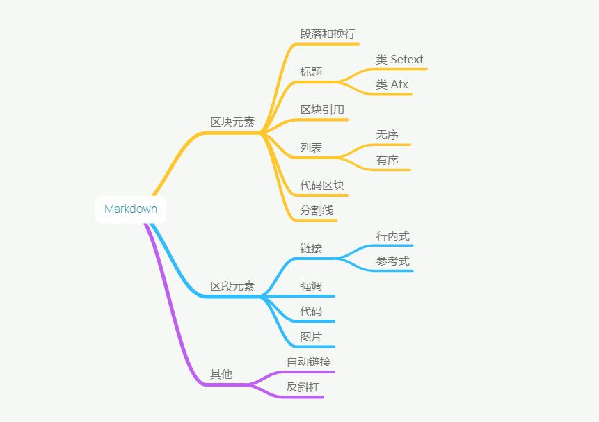

# 简介
## 目标

轻量级的标记型语言，兼容 HTML， 易读易写

语法的目标是：成为一种适用于网络的书写语言

格式语法在HTML区块标签内无效，而在HTML区段标签内有效

自动转换，不须特殊处理 < 与 &

工具：Atom、Marp

---

---

# 区块元素

1. 段落和换行
2. 标题
3. 区块引用
4. 列表
5. 代码区块
6. 分隔线

---

## 段落和换行

段落由一个或多个连续的文本行组成，它的前后要有一个以上的空行
普通段落不该用空格或制表符来缩进。

> 注：Atom中插入&lt;br/>强制换行，但Marp仅回车即可
---

## 标题
类 Setext：利用 = 与 - ，至少两个。
> 类 Setext
> \------

类 Atx 形式：行首（必须）插入 1 到 6 个 # ，标题文字前加空格，闭合后更美观
> \## 这是 H2
> \## 这是 H2 ##

---

## 区块引用
使用 > ，可以嵌套
> 引用的区块内可以使用其他的 Markdown 语法
>> 引用的最后空一行（回车）

---

## 列表
**无序列表** 标记： * 、+ 、- 加空格，可混用，非第一项可以使用有序列表标记

**有序列表** 标记：第一项必须数字 + 英文句点，可无序，非第一项可使用 * + -

> 列表标记最多可缩进3个空格，标记后面必须至少一个空格或制表符

可嵌套，但属于子项的标记符号应相对于其父标记缩进

项目内可使用 ***段落*** 和 ***区块引用***，留心项目间的空行

---

## 代码区块

缩进 4 个 ***空格*** 或是 1 个 ***制表符***

前面必须空一行，并且在代码区块中，Markdown 语法不会被转换

## 分隔线

一行中使用三个以上的 * 、- 、_ 来建立一个分隔线

行内可有空格，建议使用下划线

---

# 区段元素

1. 链接
2. 强调
3. 代码
4. 图片

---

## 链接

***行内式*** 的链接：`` [Key](LinkPath "Option Title") ``

***参考式*** 的链接：`` [Key][id] (另起它行) id：[id]: LinkPath "Option Title" ``

*隐式链接* ：省去id，直接定义Key

id不区分大小写，位置任意；Title不限于使用双引号，还可以单引、括号

链接网址可以用 <> 限定

---

## 强调
使用 * 或 _ ，下划线更易读

斜体强调: ``_被强调的文字_``

粗体强调：``__被强调的文字__``

粗体加斜体强调：``___被强调的文字___``

> 注：Marp不支持下划线

---

## 代码

标记一小段***行内代码*** ：用反引号（\`）包起来

在代码区段内插入反引号：多个反引号来开启和结束代码区段

    `` 插入个单引号:` ``
> 代码区段内的 & 和 < 都会被自动地转成 HTML 实体

---

## 图片

与链接方式相似，但要在非定义的 [Key] 前加“!”

不同的是，Key不会被显示，但Title会被显示

只能插入图片，但不能设置宽度

---

# 其它

* 自动链接：只要是用 <> 包起来， Markdown 就会自动把它转成链接。

* 反斜杠：转义

---

相关链接：

<https://blog.csdn.net/qq_29695701/article/details/79694220/>

<https://www.appinn.com/markdown/>

<http://www.markdown.cn/>

<https://www.jianshu.com/p/e063303317cb/>

<http://tinylab.org/use-markdown-to-write-slides/>

<https://github.com/yhatt/marp/releases/>
